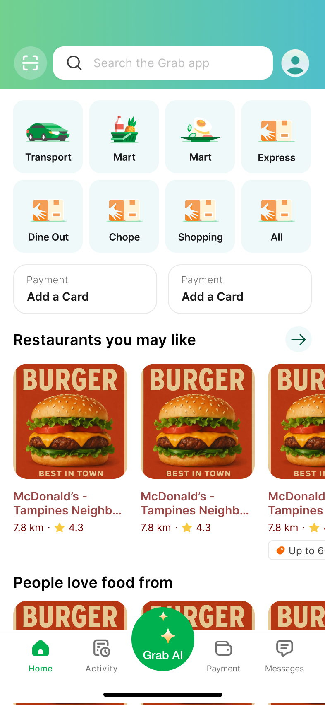

Frontend Development 
1. Project Setup & Boilerplate

Initialize Project

Bootstrap a new Expo project in frontend/mobile using npx create-expo-app@latest --template expo-template-blank-typescript.

Ensure the project uses Expo SDK 50 and TypeScript.

Confirm app.config.js reads BACKEND_BASE_URL and SOCKET_URL.

Folder Structure

Create src/components/, src/screens/, src/hooks/, src/utils/.

Add index.ts barrels for each folder.

2. Navigation & Layout

Tab Bar

Bottom tabs: Home, Activity, Grab AI (FAB), Payment, Messages.

Use @react-navigation/bottom-tabs with a custom central FAB.

Stack Navigator

Wrap Home tab with a stack for navigation to AssistantSheet and StatusTracker.

Global Theme

Integrate useColorScheme() to toggle light/dark styles.

3. Home Screen UI

Grid of Verticals

Implement HomeScreen with eight tiles: Transport, Mart, Mart (food), Express, Dine Out, Chope, Shopping, All.

Tiles use SVG/PNG assets and labels.

Payment Cards

Two placeholders with "Add a Card".

Tap handler to open modal (stubbed).

Recommendations Carousel

Horizontal FlatList of restaurant cards with image, name, distance, rating.

Placeholder data from /frontend/mobile/data/sample-recs.json.

Footer Tabs

Icon-only labels using react-native-vector-icons.

4. Grab AI Assistant Integration

FAB Component

GrabAIButton: central floating action button with Lottie sparkle.

On press: navigate to AssistantSheet via StackNavigator.

AssistantSheet Screen

Fullscreen overlay with text input, mic button, send button.

useSpeech() hook: toggle recording via Expo’s Speech-to-Text.

On send: POST to ${BACKEND_BASE_URL}/v1/context/resolve, then ${BACKEND_BASE_URL}/v1/reason/plan.

Streaming Suggestions

useSSE() hook: connect to ${BACKEND_BASE_URL}/v1/stream/updates.

Render incoming message chunks in a scrollable view.

Action Execution (stub)

When user confirms suggestion: POST plan to ${BACKEND_BASE_URL}/v1/execute and show SSE execution updates.

5. Order Status Tracking

StatusTracker Screen

Accepts orderId param.

useStatusSocket(orderId) hook: connect to SOCKET_URL and subscribe to events.

Render timeline or status icons (e.g., pending, confirmed, on-route).

Mock Data

Provide a mock JSON sequence in data/mock-status.json for unit tests.

6. WatchOS Companion Bridge

WCSession Setup

Implement WCSessionManager in mobile: listen for messages from watch.

On receiving { intent, payload }, forward to Context & Reasoning APIs, return plan diff to watch.

Methods

sendMessageToWatch(message: any) for action updates.

onMessageFromWatch(callback) to register handlers.

Testing

Simulate watch messages via a debug button on the Home screen.

7. Styling & Theming

Tailwind Classes

Define utility classes for spacing, colors, typography in tailwind.config.js.

Design Tokens

Map primary/secondary colors, font sizes, border radii in tokens.ts.

Dark Mode

Use PlatformColor() or conditional classes in components.

8. State Management & Hooks

Auth Context (stub)

Create AuthContext to manage user session (placeholder for Grab login).

Speech Hook: useSpeech()

Expose start, stop, and transcript state.

SSE Hook: useSSE()

Accept URL, return messages[] and status.

WebSocket Hook: useStatusSocket()

Accept orderId, return latest statusUpdate.
9. UI

